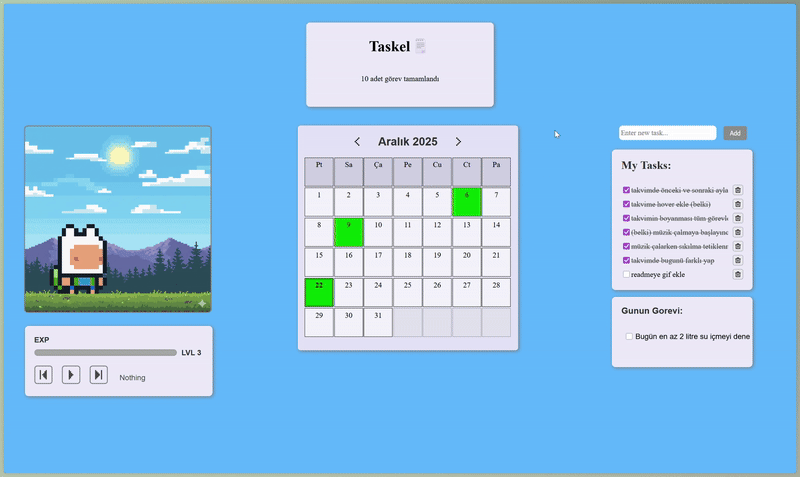

# ⚔️ Taskel: Gamified To-Do List

> "Sıradan bir yapılacaklar listesi değil, Finn ile birlikte çıktığın bir macera!"

Taskel, görev takibini sıkıcı bir zorunluluktan çıkarıp eğlenceli bir RPG oyununa dönüştüren web tabanlı bir uygulamadır. Görevleri tamamladıkça EXP kazanın, seviye atlayın ve Finn'in tepkilerini izleyin!


*(İpucu: Projenden güzel bir ekran görüntüsü alıp buraya linkini koymalısın)*
* şeklinde eklicen* 

## ✨ Özellikler

* **👾 Yaşayan Karakter (Finn):** Sadece duran bir resim değil! Görev tamamlayınca sevinir, silince üzülür, müzik çalınca dans eder ve boş durursan uyuyakalır.
* **📅 Akıllı Takvim:** Görev tamamladığınız günleri otomatik işaretler. Geçmişe dönüp baktığınızda zinciri kırmadığınızı görebilirsiniz.
* **🎮 Oyunlaştırma (Gamification):**
    * **EXP & Level Sistemi:** Her 5 görevde bir seviye atlayın.
    * **Görsel Geri Bildirim:** Tamamlanan her görev için tatmin edici animasyonlar.
* **🎧 Lofi Müzik İstasyonu:** Çalışırken odaklanmanızı sağlayacak entegre müzik çalar.
* **💾 LocalStorage Kayıt:** Sayfayı yenileseniz bile verileriniz (görevler, level, takvim geçmişi) asla kaybolmaz.
* **💡 Günlük Görev Önerisi:** Her gün size özel, rastgele bir motivasyon veya sağlık görevi önerir.

## 🛠️ Kullanılan Teknolojiler

* **HTML5 & CSS3:** Modern Flexbox/Grid yapısı ve CSS Animasyonları (Keyframes).
* **JavaScript (ES6+):** Tüm oyun mantığı, tarih hesaplamaları ve DOM manipülasyonu.
* **LocalStorage:** Veri kalıcılığı için tarayıcı hafızası.

## 🚀 Kurulum ve Çalıştırma

Bu proje herhangi bir kütüphane veya framework gerektirmez. Sadece indirin ve çalıştırın!

1.  Repoyu klonlayın:
    ```bash
    git clone [https://github.com/sencerfirtina/Taskel.git](https://github.com/sencerfirtina/Taskel.git)
    ```
2.  Klasörün içine girin ve `index.html` dosyasını tarayıcınızda açın.
3.  İyi eğlenceler!

## 🎨 Görseller ve Varlıklar

* **Karakter:** Finn (Adventure Time) Sprite Animasyonları.
* **Konuşma Balonları:** Duruma göre değişen dinamik gifler.
* **Müzikler:** Telifsiz Lofi parçalar.

## 🤝 Katkıda Bulunma

1.  Bu repoyu Fork'layın.
2.  Yeni bir özellik dalı (feature branch) oluşturun.
3.  Değişikliklerinizi yapın ve Commit'leyin.
4.  Branch'inizi Push'layın ve bir Pull Request oluşturun.

---
*Bu proje Sencer Fırtına tarafından geliştirilmiştir.*